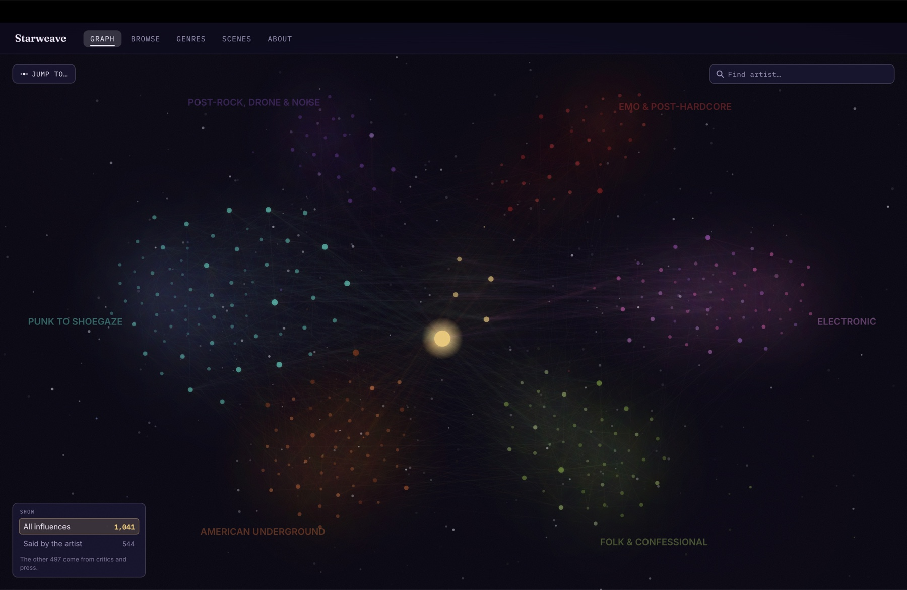
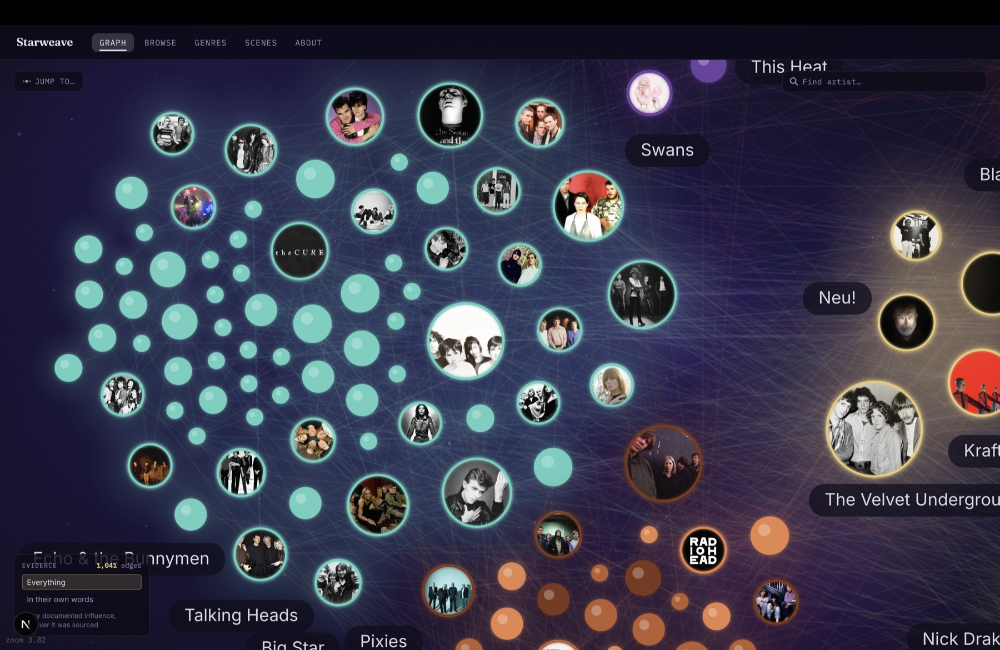
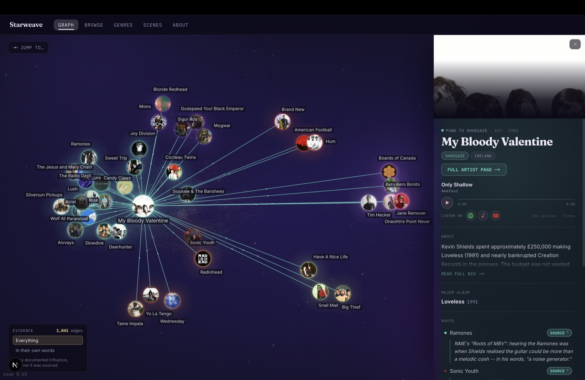
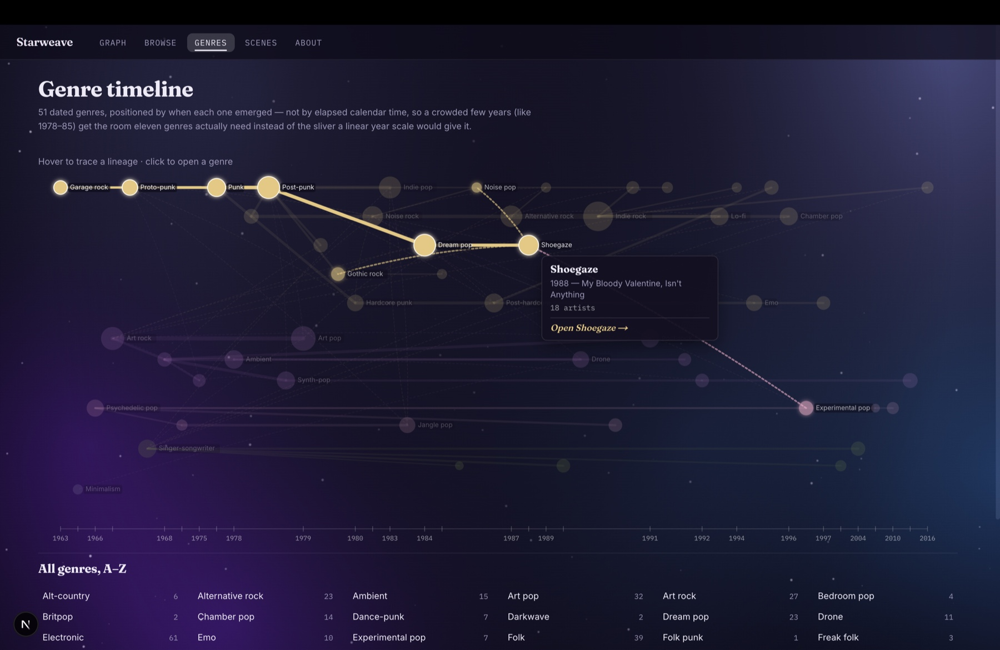
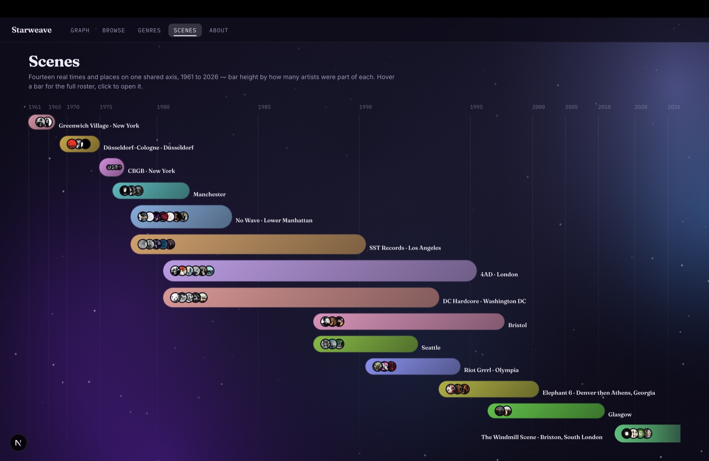
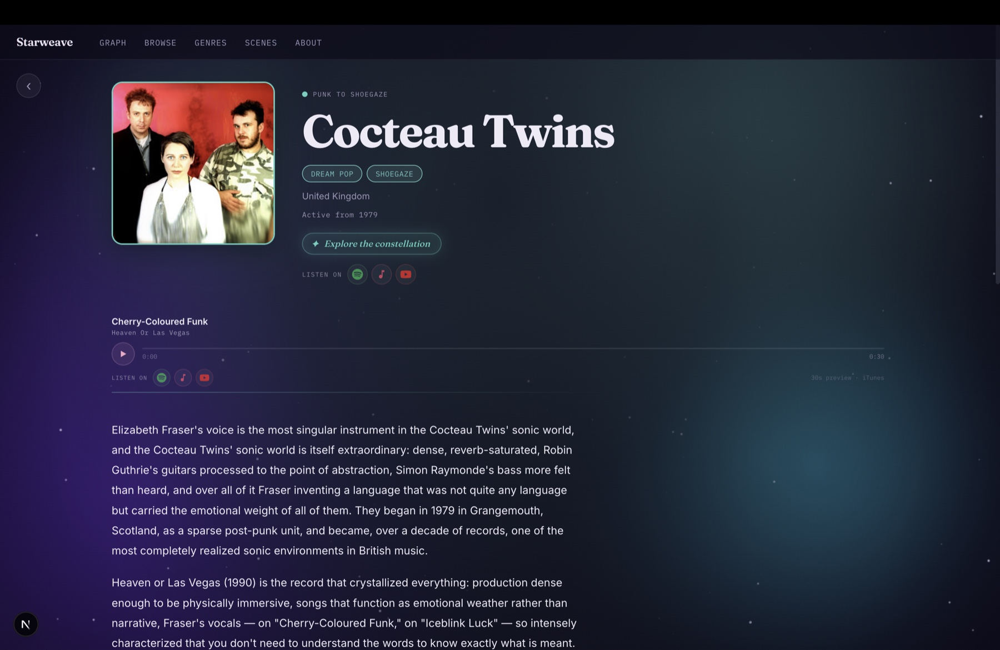
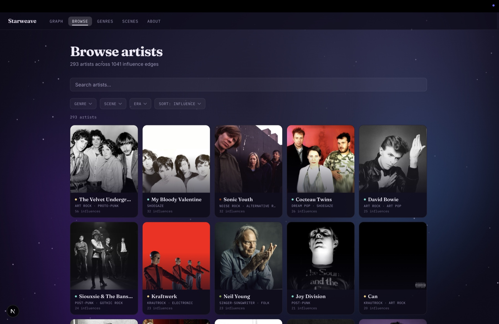

# Starweave

**An interactive map of who influenced whom in indie music - 293 artists, 1,034 sourced influence relationships, rooted at the Velvet Underground.**

**[starweaves.vercel.app](https://starweaves.vercel.app/)**

In mainstream music, legacy is measured in sales. In underground music it is measured in descendants: the Velvet Underground's first album famously sold almost nothing, and nearly everyone who bought a copy started a band. Starweave is an attempt to make that claim *checkable* - to render influence as a graph where 898 of its 1,034 edges carry a real, named source you can go and read, and the rest say plainly why they don't.



---

## Contents

- [What it actually is](#what-it-actually-is)
- [By the numbers](#by-the-numbers)
- [Features](#features)
- [The hard part: sourcing](#the-hard-part-sourcing)
- [Architecture](#architecture)
- [Performance](#performance)
- [Data model](#data-model)
- [Project structure](#project-structure)
- [Running it](#running-it)
- [Testing](#testing)

---

## What it actually is

Starweave is not a music-discovery app with a graph bolted on. The graph *is* the product: nodes are artists, directed edges are documented influence, node size is in-degree, and every feature is traversal, filtering, or path-finding over that structure.

Three things make it more than a D3 demo:

1. **The data is hand-curated and cited.** 898 of 1,034 edges carry a named source; 555 are first-person, the artist themselves saying it on the record. Not scraped, not inferred from co-listening. The 136 edges nobody has stated on the record are marked `unsourceable` rather than quietly dropped or quietly asserted.
2. **It refuses to guess.** A claim with no findable source is either marked as unsourced or not written at all. 26 recorded artist *denials* are stored separately so a future pass cannot "rediscover" a myth the artist has already rejected.
3. **It is one persistent canvas.** The force simulation never unmounts. Navigating from the graph to an artist page to a genre timeline and back preserves camera, selection and physics state.

---

## By the numbers

| | |
|---|---|
| Artists | **293** |
| Influence edges | **1,034** |
| Recorded artist denials | 29 |
| Genres (hierarchical) | 53 |
| Scenes | 14 |
| Bios / photos / album write-ups | 293 / 293 / 293 |

**Edge sourcing quality** - the number this project actually lives or dies on:

| Tier | Count | Meaning |
|---|---|---|
| First-person | **555 (54%)** | The artist said it themselves |
| Reported | 218 | A publication states it, no direct quote |
| Critic | 125 | A critic's analysis or comparison |
| Unsourceable | 136 | Real and undisputed, but nobody has said it on the record |
| Unchecked | 0 | Every inherited edge has now been checked |

**Seven realms**, laid out on an ellipse around a shared core:

| Realm | Artists | |
|---|---|---|
| `region-one` | 71 | British post-punk → shoegaze → dream-pop, plus the modern UK/Windmill bands |
| `electronic` | 59 | Krautrock, synth-pop, IDM, ambient, trip-hop, hyperpop |
| `american-underground` | 55 | Noise-alt, college rock, indie rock, psych |
| `folk-confessional` | 50 | Folk roots, freak-folk, confessional, slowcore |
| `emo-posthardcore` | 31 | Hardcore roots, post-hardcore, midwest emo, math rock |
| `post-rock-drone-noise` | 22 | Post-rock, no-wave, drone |
| `core` | 5 | Velvet Underground, Kraftwerk, Can, Neu!, Brian Eno |

Most-connected nodes: Velvet Underground (56), Sonic Youth (48), My Bloody Valentine (39), Cocteau Twins (31), Siouxsie & The Banshees (30).

---

## Features

### Subtract the evidence and see what's left

The graph claims its edges are checkable. The evidence filter is how a visitor
tests that instead of taking it on faith - a single switch that ghosts every
connection the artist didn't state themselves, with a live count:

| Mode | Edges | |
|---|---|---|
| **Everything** | 1,034 | Every documented influence, however it was sourced |
| **In their own words** | 555 | Only where the artist said it themselves, on the record |

Failing edges are **ghosted, never removed**. The constellation's shape is the
thing being looked at, and deleting half its threads would read as a rendering
fault rather than as an argument about sourcing. Watching 1,034 fall to 555
while the structure still holds is the most honest thing the project does.

Deliberately binary. A middle "has a citation" tier (898 edges) was built and
then cut: that distinction already appears per-edge in the artist panel, where
a cited row offers its quote and an unsourceable one says so plainly. Repeating
it as a graph-wide mode duplicated a row-level detail while diluting the only
comparison worth making.

### Zoom is the level-of-detail control

Pulled out, the graph is a starfield: every artist is a coloured point sized by influence, with per-realm nebula glow and only the top 12 hubs labelled. Zoom in and photos, names and relationships resolve. The two states crossfade continuously rather than switching, and the fade is hub-biased so influential nodes resolve first.



### Click any node to focus it

The camera frames the artist and its direct neighbours, everything else dims to a ghost layer, and a panel opens with the bio, a major album, an audio preview, and both influence lists - each row showing where the claim came from. Cited rows expand inline to the actual quote.

Below: My Bloody Valentine and its descendants, with the Ramones citation expanded - Kevin Shields in NME on hearing them and realising the guitar could be "a noise generator."



### Genre and scene highlighting

A parallel highlight system to click-focus: pick a genre or scene and its members light up across the whole constellation, showing how a tag scatters across realms rather than clustering neatly. Clicking a member re-centres within the set instead of dropping out of it.

### Two purpose-built timelines

`/genres` is a subway map of 51 dated genres positioned by emergence rank and lineage, with hover-to-trace-ancestry. `/scenes` places 14 scenes on a **density-weighted** time axis - years where more was happening get more width, so 1976-2000 occupies 70% of the axis instead of 41%.





### Artist pages

Full bios, a major-album card with cover art and a write-up, streaming links, and photo-grid influence lists that toggle into a sourced citation view.



### Browse

Every artist in one grid, searchable and filterable by genre, scene and era, sorted by influence by default.



### Built for phones

Below 600px the side drawer becomes a two-state bottom sheet: a peek bar with the artist, their signature track, a play button and their connection count, expanding on tap. The focus camera knows the sheet is there and frames the cluster above it, rather than centring it behind it.

---

## The hard part: sourcing

Anyone can draw a graph. The work here was deciding what earns an edge.

**Rules that produce false edges, all learned the hard way:**

- **Personnel, production, label and collaboration are not influence.** A shared producer, a guest feature or a label roster looks like a citable connection and is not one. This is the single largest false-positive category across every research pass.
- **A cover version is devotion, not influence.** A whole covers album looks even more like influence and is still not a claim.
- **Critic sentences do not check dates.** One Stereogum sentence named five descendants of a band; three of them formed *before* it. Chronology is checked against release dates, not formation dates.
- **Repetition across aggregators is not corroboration.** Identically-worded bios propagating between sites are one unsourced claim, not many.
- **Grokipedia is banned outright.** It fabricates influence claims that look sourced. Its failure mode is *substitution* - the invented name is always plausible - which is worse than open invention. Seven encounters, three confirmed fabrications.

**Rules that find real edges:**

- **Never search "who cites X." Search the suspected descendant's own interviews.** Upstream questions have bounded answers; downstream ones don't. Not one edge from a 64-edge research pass came from a query containing the word "influence."
- **Artist-curated sources beat press.** The Quietus's *Baker's Dozen*, gear-and-technique interviews, artist-written playlist commentary.
- **Anchor on album titles when the artist's name is a common word** - Beck, Wire, Hum, Low, Women, Suicide, Faust.

**A denial is data.** When an artist explicitly rejects an assumed influence, that is recorded in a separate `rejectedEdges` array so it is never re-proposed. Car Seat Headrest denying Pavement, Sonic Youth, Dinosaur Jr. and the Strokes is a fact about Car Seat Headrest worth keeping. Notably, in five of six denials resolved in one pass, the denied edge was that band's *single most-repeated* critical comparison.

---

## Architecture

**Stack:** Next.js 16 (App Router) · React 19 · TypeScript strict · `react-force-graph-2d` on canvas · static JSON · no database.

### Persistent graph shell

Every content route lives inside the `(graph)` route group. `app/(graph)/layout.tsx` mounts `<GraphView>` once, unconditionally, with `{children}` rendered over it as a full-bleed overlay. Navigating anywhere in the app never unmounts the simulation.

This is not a micro-optimisation. Each route that sat *outside* the group paid a full remount on first cross-navigation - a ~300-tick layout pre-settle over 293 nodes, measured at roughly 5 seconds. Any new top-level page needs three things or it silently reintroduces the bug: live inside `(graph)`, carry an opaque overlay class, and be added to `GraphView`'s backgrounded-route check.

### Build-time data pipeline

`data/seed-data.ts` (hand-curated) → `scripts/build-graph.ts` → `public/graph.json`.

The script validates every edge endpoint against a real artist ID and exits non-zero on a dangling reference, computes `influenceScore` as in-degree, and enriches with artist photos (Deezer) and album art (iTunes). Network calls go through a timeout wrapper with exponential backoff on rate limits - an earlier version silently treated a 429 as "no match found" and quietly degraded coverage at scale.

### Layout forces

Node positions are solved **synchronously before the canvas ever mounts**, so there is no scattered first frame. Core sits at the origin; each realm is pulled toward a named angle on an ellipse, so adding a realm cannot shift the existing ones. Realm-tagged nodes get weaker mutual repulsion so each cluster blooms tightly, cross-realm edges get weakened link strength, and a hand-rolled positional collision force runs three passes per tick.

---

## Performance

The canvas repaints every frame (`autoPauseRedraw={false}`), which is required for the continuous zoom crossfade. That makes per-frame cost the whole ball game:

- **Never build a `CanvasGradient` per node per frame.** Every glow is pre-rendered once into an offscreen sprite and stamped with `drawImage`. Violating this once caused a severe measured regression.
- **`ctx.shadowBlur` is banned in the draw loop.** It forces an offscreen blur pass per call. The core-edge "galaxy arm" glow was 126 blurred strokes *per frame*; it is now a two-pass stroke - a wide faint underlay beneath a narrow bright one - for the same visual result at a fraction of the cost.
- **Hit-testing mirrors drawing exactly**, with one deliberate documented exception: on touch, the pick radius is floored at a fingertip so 3px nodes stay tappable.

---

## Data model

Full schema in `data/types.ts`.

```ts
Artist   id · name · layer · realm · lineage · genres[] · country
         activeFrom · bio · imageUrl · classicAlbums[] · previewUrl

Edge     source · target        // source was influenced BY target
         type · status · confidence
         citation              // a finished sentence, for a reader
         citationStatus        // 'unsourceable' | 'unchecked' | (cited, derived)
         sourceTier            // 'first-person' | 'reported' | 'critic'

RejectedEdge  source · target · citation · strength
Genre         id · name · parent · alsoFrom[] · emerged · emergedBasis
Scene         id · name · city · yearStart · yearEnd? · memberIds[]
              placeAndTime[] · memberRoles[] · legacy
```

Two conventions worth calling out:

**`citation` must read as a finished sentence for an end reader** - never internal notes. No confidence tags, no repo file paths, no cross-references to other edges. Sourcing tier is a structured field a UI can render, not a word to parse out of prose.

**`Genre.parent` must express genuine musical descent, not bucketing.** Three audit passes removed organisational containers masquerading as ancestors and fixed chronologically impossible parents. One known case is still held rather than forced: minimalism (1964) has no valid parent, because the proposed one emerged 14 years after it.

---

## Project structure

```
app/(graph)/          all content routes - graph, artist, genre, scene, browse, about
components/graph/     ForceGraph (canvas + physics), GraphView, ArtistPanel, controls
components/genres/    subway-map timeline
components/scenes/    density-weighted scene timeline
lib/                  colours, layout maths, graph utils, media-query hooks
data/                 seed-data (source of truth), types, genre page copy
scripts/              build-graph pipeline
tests/                vitest - BFS, build validator, components
```

`components/graph/ForceGraph.tsx` is ~3,500 lines and heavily commented. The comments explain *why* a constant has its value and what broke last time, which matters more than what the code does.

---

## Running it

The deployed build is at [starweaves.vercel.app](https://starweaves.vercel.app/).
To run it locally:

```bash
npm install
npm run build:data    # generates public/graph.json - run once before dev
npm run dev           # localhost:3000
```

| Command | |
|---|---|
| `npm run dev` | Dev server |
| `npm run build:data` | Regenerate `public/graph.json` from `seed-data.ts` |
| `npm run build` | Production build (runs `build:data` first) |
| `npm run typecheck` | `tsc --noEmit` |
| `npm run lint` | ESLint |
| `npm test` | Vitest |

**`lib/graph-data.ts` caches `public/graph.json` at module level** - restart the dev server after regenerating it, or you will keep reading the old graph.

---

## Testing

23 tests across 3 files, run on every push via GitHub Actions (`.github/workflows/ci.yml`):

- **Build validator** - dangling edge endpoints must fail the build
- **BFS path-finding** - the shortest-path traversal between any two artists
- **Component rendering**

---

## Credits

Artist images via Deezer. Album artwork and audio previews via iTunes. Every influence claim is attributed inline to its original publication, interview or book - the point of the project is that you can go and check.
